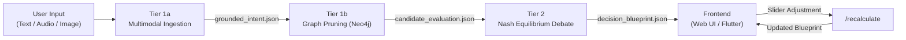

# FIPE Mood4Food MVP — Complete System Rundown

This document is a comprehensive, file-by-file breakdown of everything we have built in the `MVP/` directory.

---

## High-Level Architecture

The system is a **3-Tier, local-first, offline-capable food recommendation engine**. A user describes what they want to eat in natural language. The system translates that into structured constraints, prunes unsafe dishes from a knowledge graph, and then runs a multi-agent debate to mathematically rank the surviving candidates.



The tiers communicate exclusively through **JSON contract files** on disk, making the system fully modular and debuggable.

---

## Root-Level Files

### [orchestrator.py](file:///d:/OFFICE%20WORK/FIPE/Code/MVP/orchestrator.py)
**Role:** The central nervous system. A FastAPI application that wires all three tiers together and serves the frontend.

| Route | Method | Purpose |
|---|---|---|
| `/` | GET | Serves the web UI (`index.html`) |
| `/submit` | POST | Accepts multipart form data (text, audio file, image file). Runs the full 3-stage pipeline: ingestion → graph pruning → debate. Returns the `decision_blueprint`. |
| `/decision_blueprint` | GET | Returns the last-generated blueprint JSON (used by Flutter on boot). |
| `/recalculate` | POST | Accepts a `w_budget` float from the UI slider. Re-scores all candidates with new weights **without re-querying the LLM or database**. Instant. |

**Key implementation details:**
- The `/recalculate` endpoint reads `direct_dish_prompt` from `candidate_evaluation.json` and applies the force-win override if a dish name matches (Lines 168, 190-192).
- Budget utility in `/recalculate` still uses the original `exp(-0.01 * price)` formula (Line 185) — this is intentionally independent from the Tier 2 debate's softer curve, since the slider is a direct user control.

---

### [seed_neo4j.py](file:///d:/OFFICE%20WORK/FIPE/Code/MVP/seed_neo4j.py)
**Role:** Database seeder. Populates the Neo4j knowledge graph with the complete food catalogue.

**What it creates:**
- **55 Dish nodes** across 10 categories: Vegetarian, Chicken, Mutton/Beef, Fish/Seafood, Egg, Bread, Tofu/Vegan, Lentil/Rice, Sweet/Dessert, Street Food, Nut-Based, Fresh/Light, Premium.
- **65+ Ingredient nodes** (proteins, legumes, vegetables, dairy, nuts, spices, pantry items).
- **~600 `[:CONTAINS]` relationships** linking dishes to their ingredients.

Each dish has: `dish_id`, `name`, `price_pkr`, `protein_g`, `calories`, `synthesized_calories`.

The ingredient graph is critical for allergen pruning — if a user says "no dairy", the Cypher query walks up to 5 hops through `[:CONTAINS]` to find and remove any dish connected to a dairy ingredient.

---

### [Modelfile](file:///d:/OFFICE%20WORK/FIPE/Code/MVP/Modelfile)
**Role:** Ollama model registration file for the fine-tuned Phi-3.5 LLM.

**Key configuration:**
- `FROM ./phi-3.5-mini-instruct.Q4_K_M.gguf` — points to the 2.3 GB quantized GGUF weight file.
- `PARAMETER temperature 0` — forces deterministic output (no randomness).
- `PARAMETER num_predict 256` — caps output length to prevent runaway generation.
- `PARAMETER stop` — multiple stop tokens (`"Output Explanation"`, `"Request:"`, `"User"`, `"##"`) to prevent the model from hallucinating extra text beyond the JSON.
- `TEMPLATE` / `SYSTEM` — enforces the contract: the model is a "deterministic semantic translator" that outputs **only** the Grounded Intent JSON. No conversation, no explanations.

---

### [dataset.jsonl](file:///d:/OFFICE%20WORK/FIPE/Code/MVP/dataset.jsonl)
**Role:** The 41-example fine-tuning dataset used to train the Phi-3.5 model via Unsloth.

Each line is an `{instruction, output}` pair mapping natural language to the exact JSON contract the model should produce. Examples:
- `"I need a high-protein chicken tikka under 1000 rupees"` → `{budget_max_pkr: 1000, allergens_pruned: [], protein_priority: "high", mood_vector_seed: "tikka_chicken"}`
- `"Can I get a beef nihari which costs 800 rupees. I am allergic to dairy."` → `{budget_max_pkr: 800, allergens_pruned: ["dairy"], ...}`

---

### [phi-3.5-mini-instruct.Q4_K_M.gguf](file:///d:/OFFICE%20WORK/FIPE/Code/MVP/phi-3.5-mini-instruct.Q4_K_M.gguf)
**Role:** The quantized model weights (2.3 GB). This is the base Phi-3.5 Mini Instruct model in Q4_K_M GGUF format, fine-tuned on `dataset.jsonl` and served locally via Ollama.

---

### [test_suite.py](file:///d:/OFFICE%20WORK/FIPE/Code/MVP/test_suite.py)
**Role:** Automated validation harness. 16 end-to-end tests using FastAPI's `TestClient`.

**What it tests:**
- **Tests 1-15:** Submit 15 different natural language queries through the full pipeline. For each, it verifies:
  - The `/submit` endpoint returns HTTP 200.
  - `candidate_evaluation.json` is created.
  - The expected allergens appear in `allergens_pruned` (e.g., "dairy" for "no dairy").
  - `/recalculate` with a specific `w_budget` returns HTTP 200 and a valid winner.
  - When `w_budget = 1.0`, the cheapest dish wins (mathematical invariant check).
- **Test 16 (SDUI Schema Validation):** Verifies that `decision_blueprint.json` contains all required keys: `winning_dish`, `utility_breakdown`, `agent_weights`, `all_candidate_scores`.

---

### [requirements.txt](file:///d:/OFFICE%20WORK/FIPE/Code/MVP/requirements.txt)
Core dependencies: `fastapi`, `uvicorn`, `neo4j`, `pydantic`, `httpx`, `numpy`, `openai-whisper`, `python-multipart`.

### [DEPLOYMENT_RUNBOOK.md](file:///d:/OFFICE%20WORK/FIPE/Code/MVP/DEPLOYMENT_RUNBOOK.md)
A 389-line step-by-step guide covering environment setup, Neo4j Docker container, Ollama model registration, database seeding, backend startup, Flutter frontend, and verification.

### [README.md](file:///d:/OFFICE%20WORK/FIPE/Code/MVP/README.md)
Project overview documenting the 3-tier architecture, data flow, and design rationale.

---

## Tier 1: Perception & Grounding

### [tier_1/multi_modal_ingestion.py](file:///d:/OFFICE%20WORK/FIPE/Code/MVP/tier_1/multi_modal_ingestion.py) (427 lines)
**Role:** Tier 1a — the "ears and eyes" of the system. Accepts raw human input and translates it into a structured JSON contract.

#### Ingestors
| Function | Input | Output |
|---|---|---|
| `ingest_audio(path)` | `.wav`, `.mp3`, `.m4a`, etc. | Transcribed text via OpenAI Whisper (base model, lazy-loaded) |
| `ingest_vision(path)` | `.jpg`, `.png`, `.webp` | Extracted keywords from filename (smart stub; production would use Moondream2) |
| `ingest_text(raw)` | Raw string | Lowercased, whitespace-collapsed text |

#### Multimodal Merge
`merge_modalities()` combines all modality outputs into one string. It deduplicates audio if it overlaps >70% with typed text (using word-set intersection).

#### Intent Extraction — Dual-Path Architecture
This is the core intelligence. Two paths, used in sequence:

**Path 1: LLM (Primary)** — [extract_intent_llm()](file:///d:/OFFICE%20WORK/FIPE/Code/MVP/tier_1/multi_modal_ingestion.py#L142-L186)
- Sends the merged text to Ollama (`mood4food` model) via HTTP.
- The model returns raw JSON which is parsed and normalized by `_normalize_llm_intent()`.
- Gracefully falls back on: `ConnectError` (Ollama not running), `HTTPStatusError`, `TimeoutException`, `JSONDecodeError`.

**Path 2: Keyword Fallback** — [extract_intent_keywords()](file:///d:/OFFICE%20WORK/FIPE/Code/MVP/tier_1/multi_modal_ingestion.py#L222-L292)
- Pure Python, zero dependencies. Used when Ollama is unavailable.
- Extracts budget (first number found), allergens (keyword + negation window), protein priority, and mood vector seed.
- **Our fix:** Allergens are only excluded if a negation word (`"no"`, `"without"`, `"allergy"`, `"cant"`, etc.) appears within a 2-word window before the ingredient keyword.

#### LLM Post-Processing Guardrail — [post_process_llm_allergens()](file:///d:/OFFICE%20WORK/FIPE/Code/MVP/tier_1/multi_modal_ingestion.py#L295-L338)
**This is one of our key additions.** A deterministic state-machine that runs after the LLM returns, catching two classes of errors:

1. **False Positives (LLM over-pruned):** If you type "chicken biryani" and the LLM incorrectly adds "meat" to allergens, the guardrail detects that "chicken" was mentioned *without* a negation word, so it *removes* "meat" from the list.
2. **False Negatives (LLM under-pruned):** If you type "without dairy and meat" and the LLM only catches "dairy", the guardrail's `is_negated` state stays `True` through the word "and", catching "meat" and *adding* it to the list.

The state resets on context-switching words: `"with"`, `"but"`, `"plus"`, `"want"`, `"like"`.

#### Direct Dish Prompting
[extract_intent()](file:///d:/OFFICE%20WORK/FIPE/Code/MVP/tier_1/multi_modal_ingestion.py#L341-L360) injects the raw user query as `direct_dish_prompt` into `soft_constraints`. This is read downstream by Tier 2 to force-win a specific dish.

#### Pipeline Entry Point
[run_ingestion_pipeline()](file:///d:/OFFICE%20WORK/FIPE/Code/MVP/tier_1/multi_modal_ingestion.py#L382-L420) — orchestrates all steps and writes `grounded_intent.json`.

---

### [tier_1/symbolic_anchoring.py](file:///d:/OFFICE%20WORK/FIPE/Code/MVP/tier_1/symbolic_anchoring.py) (152 lines)
**Role:** Tier 1b — the "safety firewall". Reads the grounded intent, queries Neo4j, and prunes unsafe dishes.

#### The Cypher Query
```cypher
MATCH (d:Dish)
WHERE d.synthesized_calories <= 1000
  AND NOT EXISTS {
    MATCH (d)-[:CONTAINS*1..5]->(i:Ingredient)
    WHERE toLower(i.name) IN $pruned_list
  }
RETURN d.dish_id, d.name, d.price_pkr, d.protein_g, d.calories
```
This walks up to 5 hops through the ingredient graph. If *any* ingredient in a dish's chain matches a pruned allergen, the entire dish is excluded. This is why "Chicken Biryani" gets pruned when you say "no dairy" — because the graph knows Chicken Biryani contains yogurt, which is dairy.

#### Output
Writes `candidate_evaluation.json` containing: the original intent context, the list of safe candidate dishes, and the candidate count.

---

### [tier_1/contracts/](file:///d:/OFFICE%20WORK/FIPE/Code/MVP/tier_1/contracts)
Three JSON files that form the inter-tier communication protocol:

| File | Producer | Consumer |
|---|---|---|
| `grounded_intent.json` | Tier 1a | Tier 1b |
| `candidate_evaluation.json` | Tier 1b | Tier 2 |
| `decision_blueprint.json` | Tier 2 | Frontend |

---

## Tier 2: Multi-Agent Debate

### [tier_2/agents.py](file:///d:/OFFICE%20WORK/FIPE/Code/MVP/tier_2/agents.py) (169 lines)
**Role:** The three "utility agents" — pure mathematical functions with no external dependencies.

#### Utility Calculators

| Agent | Formula | Range |
|---|---|---|
| **Health** (`calculate_health_utility`) | `(protein_g / calories) / 0.05` | `[0.0, 1.0]` — 50g protein per 1000 kcal = perfect 1.0 |
| **Budget** (`calculate_budget_utility`) | `exp(-0.002 * price)` | `[0.0, 1.0]` — **softened from the original `-0.01`** |
| **Taste** (`calculate_taste_utility`) | `cos(dish_vector, mood_vector)` | `[0.0, 1.0]` — cosine similarity, clamped to non-negative |

**Our fix:** The budget decay was changed from `exp(-0.01 * price)` to `exp(-0.002 * price)`. This rebalances the utility math so that a 500 PKR dish (utility ~0.37) can compete with an 80 PKR dish (utility ~0.85) if it scores higher on health or taste.

#### Local Vector Store
`LocalVectorStore` — a lightweight JSON-backed vector store that mirrors the ChromaDB API. Used because ChromaDB requires MSVC C++ Build Tools on Windows. Stores dish and mood embeddings as `{doc_id: {embedding: [...], metadata: {...}}}`.

---

### [tier_2/consensus_manager.py](file:///d:/OFFICE%20WORK/FIPE/Code/MVP/tier_2/consensus_manager.py) (280 lines)
**Role:** The "parliament". Runs a weighted utility aggregation loop with automatic constraint relaxation.

#### The Debate Algorithm — [run_debate()](file:///d:/OFFICE%20WORK/FIPE/Code/MVP/tier_2/consensus_manager.py#L98-L192)

1. **Initial Weights:** `w_health=0.4`, `w_budget=0.3`, `w_taste=0.3` (must sum to 1.0).
2. **Scoring:** For each candidate: `U_total = (w_h × U_health) + (w_b × U_budget) + (w_t × U_taste)`.
3. **Direct Dish Override:** If `direct_dish_prompt` is set and a candidate's name is a substring match, `U_total` is overridden to `1000.0` — guaranteeing it wins.
4. **Winner Election:** The dish with the highest `U_total` wins.
5. **Constraint Relaxation:** If *all* utilities are zero (extreme edge case), the system automatically degrades `w_budget` by 0.1 per round and redistributes the freed weight equally to health and taste. This runs up to 5 rounds before falling back to the first candidate.

#### XAI Traces
Every scoring decision is logged as a human-readable string in `xai_traces`. These are displayed in the "How It Works" collapsible panel in the frontend.

---

## Frontend

### [web_ui/](file:///d:/OFFICE%20WORK/FIPE/Code/MVP/web_ui) — Browser-Based UI

Three files, served statically by FastAPI:

#### [index.html](file:///d:/OFFICE%20WORK/FIPE/Code/MVP/web_ui/index.html) (78 lines)
Semantic HTML5 with: a hero header, a search bar with text input + audio/image upload buttons, loading/error/content states, and a `main-content` div populated by JavaScript.

#### [style.css](file:///d:/OFFICE%20WORK/FIPE/Code/MVP/web_ui/style.css) (22 KB)
Premium design system with: warm gradient backgrounds, glassmorphism cards, animated score bars, pulse animations on winner card updates, responsive layout, and custom-styled range slider.

#### [app.js](file:///d:/OFFICE%20WORK/FIPE/Code/MVP/web_ui/app.js) (492 lines)
Complete client-side logic:
- `submitQuery()` — builds `FormData` with text + optional audio/image files, POSTs to `/submit`, renders the result.
- `recalculate()` — sends the slider's `w_budget` value to `/recalculate`, then calls `updateDynamic()` for a fast targeted DOM update (no full re-render).
- `render()` — full DOM construction: context bar (budget, excluded, mood), winner card, score breakdown bars, budget slider, candidate grid, XAI trace panel.
- `updateDynamic()` — surgical DOM updates for slider changes only (updates text, bar widths, candidate grid, XAI traces without rebuilding the entire page).
- File attachment management with visual chips and removal.

### [fipe_flutter/](file:///d:/OFFICE%20WORK/FIPE/Code/MVP/fipe_flutter) — Flutter Mobile/Desktop UI

A single-file Dart app ([main.dart](file:///d:/OFFICE%20WORK/FIPE/Code/MVP/fipe_flutter/lib/main.dart), 408 lines) that mirrors the web UI's functionality:
- Dark theme with Material 3 design.
- Fetches `decision_blueprint` from the API on boot.
- Displays the winning dish, utility breakdown, budget slider, and candidate list.
- Budget slider triggers `/recalculate` calls.

---

## Modifications Made During This Session

| Change | File | What & Why |
|---|---|---|
| **Negation-aware allergen parser** | `multi_modal_ingestion.py` L259-266 | Allergens only excluded if preceded by a negation word within 2 words. Fixes "chicken biryani" falsely pruning meat. |
| **Direct dish prompt injection** | `multi_modal_ingestion.py` L357-358 | Injects raw query into `soft_constraints.direct_dish_prompt` so Tier 2 can detect exact dish requests. |
| **LLM post-processing guardrail** | `multi_modal_ingestion.py` L295-338 | State-machine that corrects LLM false positives and false negatives for allergens. |
| **LLM guardrail integration** | `multi_modal_ingestion.py` L348-350 | Applies `post_process_llm_allergens()` immediately after `extract_intent_llm()` returns. |
| **Force-win in debate** | `consensus_manager.py` L130-133 | If `direct_dish_prompt` matches a candidate name, override utility to 1000.0. |
| **Force-win in debate pipeline** | `consensus_manager.py` L250, L262 | Extract and pass `direct_dish_prompt` through `run_debate_pipeline()`. |
| **Force-win in recalculate** | `orchestrator.py` L168, L190-192 | Mirror the force-win logic in the `/recalculate` endpoint for slider consistency. |
| **Softer budget utility curve** | `agents.py` L123 | Changed from `exp(-0.01 * price)` to `exp(-0.002 * price)` so health/taste agents can compete against cheap dishes. |

---

## Data Flow Example

Here is the complete path for the query `"chicken biryani, no dairy"`:

1. **User types** → `POST /submit` with `query="chicken biryani, no dairy"`
2. **Tier 1a** — `ingest_text()` normalizes to `"chicken biryani, no dairy"`
3. **LLM** — Phi-3.5 outputs: `{allergens_pruned: ["dairy", "meat"], budget: 1000, mood: "biryani_chicken"}`
4. **Guardrail** — `post_process_llm_allergens()` detects "chicken" was mentioned *without* negation → removes "meat" from allergens. Final: `["dairy"]`
5. **Direct Dish Prompt** — `direct_dish_prompt` set to `"chicken biryani, no dairy"`
6. **Writes** `grounded_intent.json`: `{allergens_pruned: ["dairy"], direct_dish_prompt: "chicken biryani, no dairy"}`
7. **Tier 1b** — Neo4j Cypher walks the graph, removes all dishes containing dairy ingredients (including Chicken Biryani, because it contains yogurt!)
8. **Writes** `candidate_evaluation.json` with ~40 surviving candidates (no Chicken Biryani)
9. **Tier 2** — `run_debate()` checks `direct_dish_prompt` against all candidates. No match found (Chicken Biryani was pruned). Runs normal utility math.
10. **Winner:** Anda Curry (highest combined utility among dairy-free candidates)
11. **Writes** `decision_blueprint.json` → returned to frontend → UI renders result
